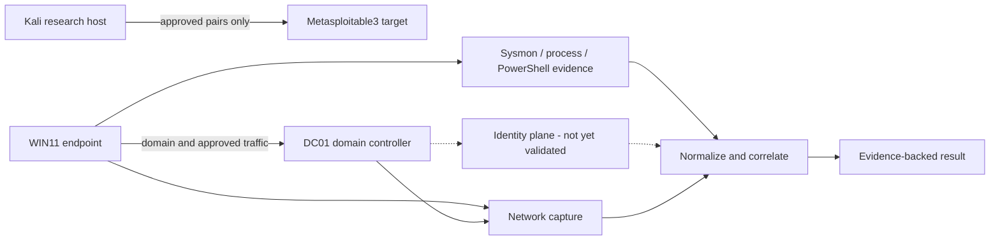

# Enterprise Purple Range

An isolated enterprise lab for correlating Windows endpoint, identity, and network evidence across authorized experiments. It is distinct from [Adversary Validation Range](https://github.com/adilalperenciftci/adversary-validation-range): the emphasis here is event normalization and cross-plane joins, not a collection of exploit demonstrations. Missing required evidence yields `INCOMPLETE` or `NOT_EVALUABLE`, never an implicit clean result.

The implemented slice includes a versioned authorization manifest, fixed-command runners, strict event normalization, an in-memory evidence graph, and correlation profiles. The lab uses the `LAB.AVR.LOCAL` domain with `DC01` and domain-joined `WIN11`; Kali and Metasploitable3 provide isolated research and target hosts. Windows media and raw captures are not bundled.



The topology is an isolation and evidence model, not proof that every host or telemetry plane was active in every experiment. `EXP-011`, for example, joins Sysmon and network capture; it does not claim an identity-plane detection.

## Experiment status

| Experiment | Evidence in this repository | Result |
| --- | --- | --- |
| `EXP-001` | Restricted service enumeration against the isolated target | `REPRODUCED`; no detection claimed |
| `EXP-002` | ProFTPD mod_copy marker, target-side proof, network rule and benign FTP baseline | `CONFIRMED/DETECTED` |
| `EXP-003` | Service attempts without a confirmed command session | `INCONCLUSIVE` |
| `EXP-004` | Synthetic payroll-row SQL injection proof, network rule and normal-login baseline | `CONFIRMED/DETECTED` |
| `EXP-011` | WIN11 Sysmon process evidence joined to VirtualBox network capture | `REPRODUCED/DETECTED` |
| Other catalog entries | Defined in the catalog but without completed experiment evidence | `NOT_TESTED` |

See the [coverage matrix](docs/coverage-matrix.md) for the full catalog, [validated findings](docs/findings.md) for proof and limits, and [methodology](docs/methodology.md) for claim states. A network alert alone is not proof of successful exploitation.

## Local verification

```text
python -m unittest discover -s tests -v
python -m compileall -q avr tests
```

Active execution requires the [range isolation](docs/range-isolation.md) checks: literal authorized targets, approved source/target pairs, VM identity, adapter topology, and egress policy. The [threat model](docs/threat-model.md) and [limitations](docs/limitations.md) describe host compromise, clock skew, and telemetry loss. Raw captures, Windows event logs, VM media, disks, snapshots, keys, and lab passwords stay outside Git.
